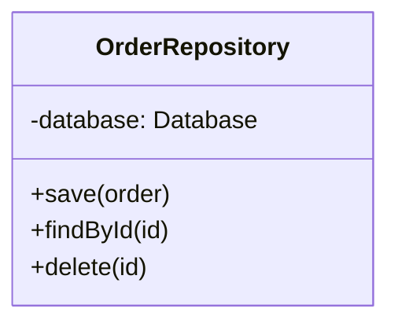

# ❌ Nível 4 desenhado para uma classe getter/setter que o código já explica

Correto em: `code-level-worth.valid.md`

## Por que não serve

- **Não revela nada que o arquivo não diga em cinco segundos.** Abrir
  `OrderRepository` mostra exatamente essas três assinaturas — o diagrama
  é uma cópia, não uma explicação.
- **Fica desatualizado no primeiro método novo.** Adicionar
  `findByCustomer(id)` exige lembrar de atualizar o diagrama; ninguém
  lembra, e o diagrama passa a mentir.
- **Nível 3 já bastava.** O Component diagram já mostrou "Repositório de
  Pedidos" como uma caixa — descer ao nível 4 aqui não resolve nenhuma
  dúvida que o nível 3 deixou em aberto.

Regra prática: se o diagrama de nível 4 pudesse ser gerado automaticamente
lendo as assinaturas do arquivo, ele não deveria ter sido desenhado à mão.
