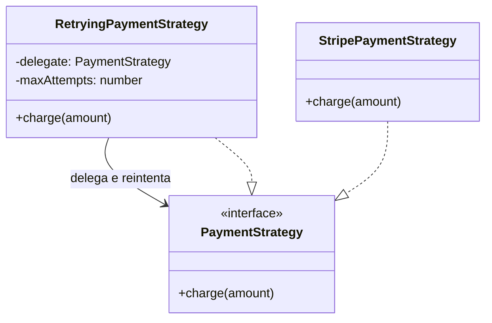

# ✅ Nível 4 (Code) desenhado só onde a estrutura não é óbvia lendo o arquivo

## Quando o nível 4 se justifica aqui

`RetryingPaymentStrategy` decora outra `PaymentStrategy` — a composição não
aparece lendo só a assinatura pública de `charge()`; o diagrama existe
porque a relação de decorador não é óbvia sem abrir o construtor.

## Por que só este e não outros

| Classe | Nível 4? | Motivo |
|---|---|---|
| `PaymentStrategy` | Sim | Faz parte da relação não óbvia acima |
| `RetryingPaymentStrategy` | Sim | É o ponto que justifica o diagrama |
| `OrderRepository` | Não | `save(order)` e `findById(id)` já dizem tudo — abrir o arquivo é mais rápido que manter um diagrama |

O critério nunca é "existe uma classe" — é "a relação entre classes é mais
rápida de entender no diagrama do que lendo o código".
