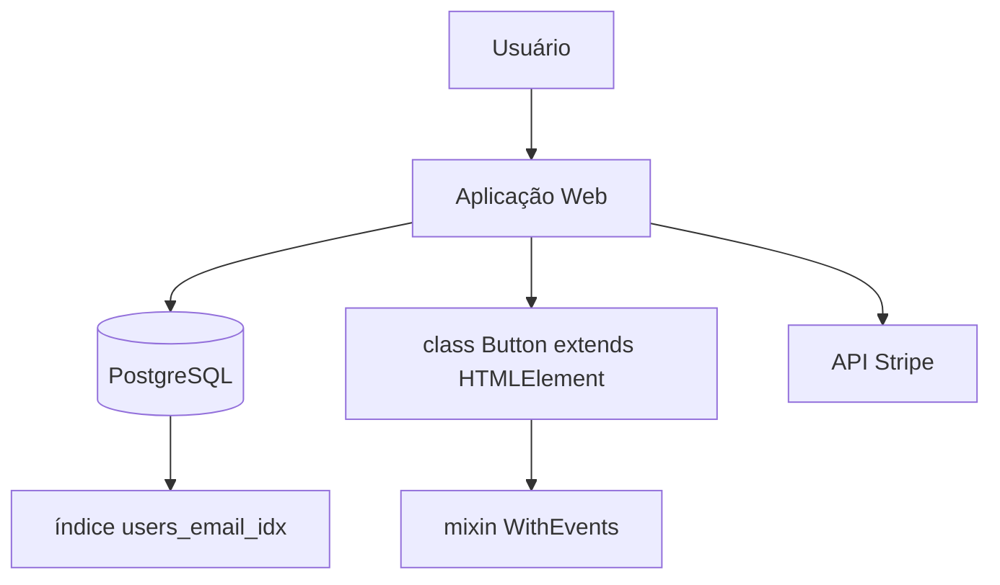

# ❌ Um diagrama com quatro níveis misturados

Correto em: `level-separation.valid.md`

## O que está errado

O desenho tem elementos de todos os quatro níveis ao mesmo tempo:

| Elemento | Nível a que pertence |
|---|---|
| Usuário, API Stripe | 1 — System Context |
| Aplicação Web, PostgreSQL | 2 — Container |
| class Button, mixin WithEvents | 4 — Code |
| índice users_email_idx | nenhum — é detalhe de schema |

Consequências:

- **Não serve a nenhum público.** Quem é de negócio se perde no mixin; quem é
  dev não encontra a informação que precisa no meio dos atores externos.
- **Não responde a pergunta nenhuma.** Cada nível existe para responder a uma
  pergunta específica; misturados, nenhuma é respondida.
- **Desatualiza imediatamente.** O nível 4 muda a cada refactor e arrasta o
  diagrama inteiro junto.

Regra de bolso: se um elemento não responde à pergunta daquele nível, ele
pertence a outro diagrama.
