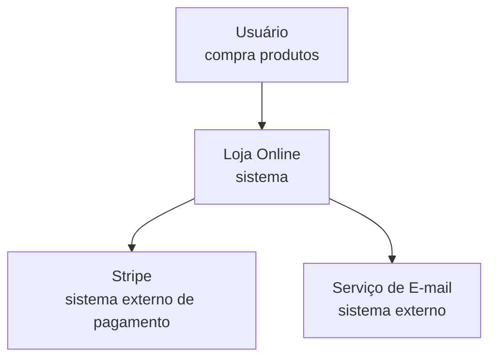
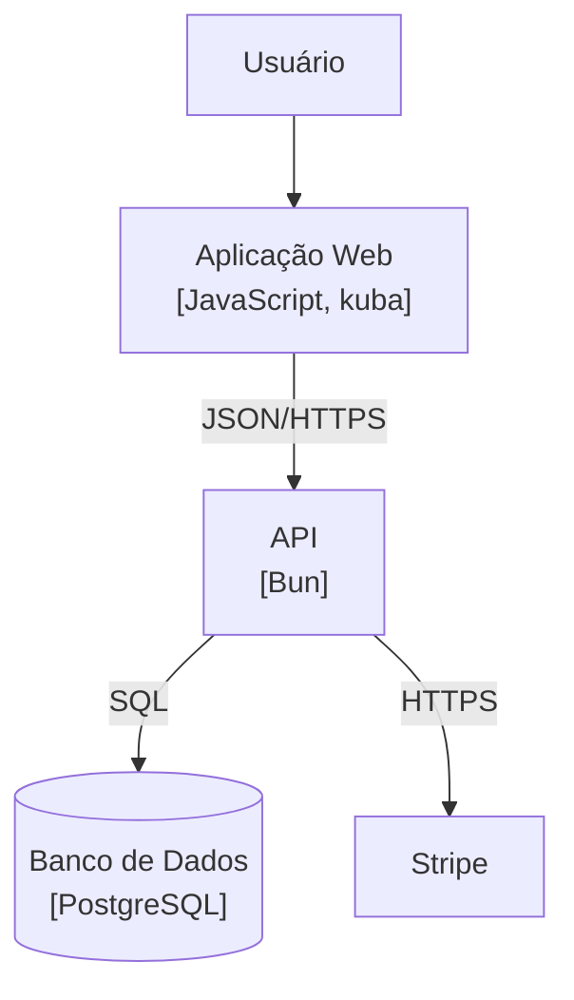
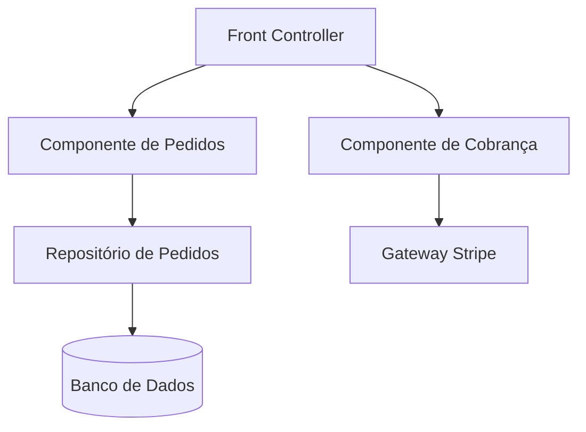

# ✅ Um nível por diagrama, nomes consistentes entre eles

## Nível 1 — System Context

*Pergunta: o que o sistema faz e com quem se conecta? Público: todos.*

Sem jargão, sem tecnologia. Alguém de negócio entende sem explicação.

## Nível 2 — Container

*Pergunta: de que partes executáveis é feito? Público: técnico.*

Aparece a tecnologia. Toda seta diz **o que trafega** e **por qual protocolo**.

## Nível 3 — Component

*Pergunta: como a API se organiza por dentro? Público: dev.*

Zoom em **um** container — a API. Os outros containers não aparecem por dentro.

## O que mantém os três coerentes

| Regra | Aplicação |
|---|---|
| Um nível por diagrama | Nenhuma classe no nível 2, nenhum ator externo no nível 3 |
| Nome idêntico entre níveis | "Banco de Dados" é o mesmo nome nos níveis 2 e 3 |
| Público define a linguagem | Nível 1 sem tecnologia; nível 3 com Repository e Gateway |
| Seta rotulada | "JSON/HTTPS", "SQL" — nunca uma seta muda |

O nível 4 não foi desenhado: nenhuma estrutura interna aqui é não óbvia o
bastante para compensar mantê-lo atualizado.
